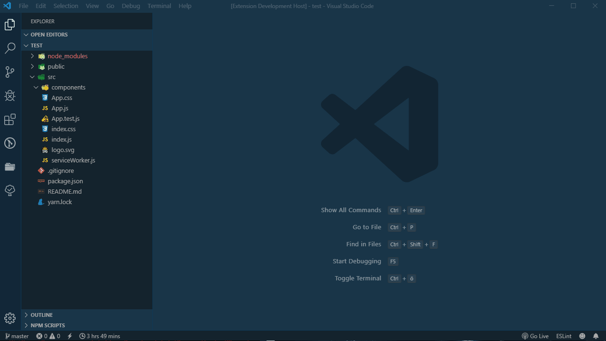

# VS-Code Fast Folder Structure

### What is this and why

VS-Code Fast Folder Structure is an extension which creates your folders/files as specified in custom templates.

Why? Because creating the same directories over and over again is annoying to do manually.

### Features

- Create your own Templates for folder structures and files and then let the extension do the rest.
- Take an existing folder and transform it into a template.
- Spend your time actually programming and not creating files.



## Templating

To create your Templates you have two options.

1. Go into your `settings.json` from VSCode and create templates [manually](#template-format). (Open the command palette and select "Open Settings (JSON)" to easily access your settings.json)
2. Right-click an existing Folder and choose "Create new FFS-Template from this folder"

### Interpolation

The value `<FFSName>` (`[FFSName]` works as well) will always be interpolated into the component name you are asked for when creating the structure.
Adding a transformer with this pattern `<FFSName | transformer>` will give you the ability to transform your componentname wherever needed.
The currently supported transformers are: `uppercase`, `lowercase`, `capitalize`, `lowercasefirstchar`, `camelcase` and `pascalcase`.

As of version 0.4 you are able to specify custom variables. You will be prompted for every custom variable defined in your [fastFolderStructure.structures](#fastFolderStructure.structures) `structure.customVariables`. These custom variables can be transformed the same way as the default `<FFSName>`

Examples

| Input            | Transformer                       | Result         | Description                                                                               |
| ---------------- | --------------------------------- | -------------- | ----------------------------------------------------------------------------------------- |
| myNewComponent   | \<FFSName \| uppercase\>          | MYNEWCOMPONENT |
| myNewComponent   | \<FFSName \| lowercase\>          | mynewcomponent |
| myNewComponent   | \<FFSName \| capitalize\>         | MyNewComponent |
| MyNewComponent   | \<FFSName \| lowercasefirstchar\> | myNewComponent |
| My-new-component | \<FFSName \| camelcase\>          | myNewComponent | (First letter is lowercased. Every letter behind a special character will be capitalized) |
| my-new-component | \<FFSName \| pascalcase\>         | MyNewComponent | (First letter and every letter behind a special character will be capitalized)            |

## Creating your Template manually

There are two key parts to creating your FFS Templates. [Folder Structures](#fastFolderStructure.structures) and [File Templates](#fastFolderStructure.fileTemplates).

### fastFolderStructure.structures

The `fastFolderStructure.structures` option takes an `array of objects` where one object equals one Folder Structure.

Example Structure

```json
{
  "name": "My Custom Template",
  "customVariables": ["CustomVar", "CustomVar2"],
  "omitParentDirectory": true,
  "structure": [
    {
      "fileName": "<FFSName>.jsx",
      "template": "Typescript Functional Component"
    },
    {
      "fileName": "tests/<FFSName>.test.js"
    },
    {
      "fileName": "index.js",
      "template": "IndexFile"
    },
    {
      "fileName": "<CustomVar>",
      "template": "EmptyDirectory"
    }
  ]
}
```

| Key                 | Type                                    | Description                                                                                                                                  |
| ------------------- | --------------------------------------- | -------------------------------------------------------------------------------------------------------------------------------------------- |
| name                | string                                  | Name of the Folder Structure.                                                                                                                |
| customVariables     | string[]                                | Custom variables that will be replaced upon folder creation                                                                                  |
| structure           | {fileName: string, template?: string}[] | Every object in this array represents a File or Folder that will be created                                                                  |
| omitParentDirectory | boolean (default: false)                | If set to true FFS will create all files directly inside the current folder instead of creating a new folder and all the files inside of it. |

If a template is specified for a file its value should match one of the names of your [fastFolderStructure.fileTemplates](#fastFolderStructure.fileTemplates) or have the `EmptyDirectory` value. If the template value is `EmptyDirectory` it will create an empty directory instead of a file.

### fastFolderStructure.fileTemplates

- The `key` of the `key-value` pair is the name of the template
- The value can either be
  - an `array` where every item in the array is a `string`. Every new item in the array will be written into a new line.
  - a `string` and you can annotate the linebreaks yourself with `\n`.

Two example filetemplates

```json
{
  "fastFolderStructure.fileTemplates": {
    "Typescript Functional Component": [
      "import React from 'react';",
      "",
      "interface <FFSName>Props {",
      "}",
      "",
      "const <FFSName> = (props) => {",
      "  return <div/>;",
      "};",
      "",
      "export default <FFSName>;"
    ],
    "Indexfile": "import <FFSName> from './<FFSName>'\n\nexport default <FFSName>;"
  }
}
```

## Creating a Template from an existing Folder

### This may not work 100% yet, if you find any issues please create a new Issue on the [Github Repo](https://github.com/Huuums/vscode-fast-folder-structure/issues)

Create a folder in the exact format you wish to have as a template.

You can use \<FFSName\> as well as \<FFSName \| transformer\> in the filenames as well as in the filecontent.
_Note: Windows users have to use \[FFSName\] instead of \<FFSName\> inside filenames as windows doesn't allow `<` and `>` in filenames._

You can use custom variables by putting them into either of the two template notations `[] or <>` inside filenames and filecontent.

When FFS tries to convert the existing folder into a template it will parse all filenames and file content inside that folder.

It will then ask you

- from which files you would like to have a filetemplate.
- which values you would like to use as Customvariables (only asks for strings inside the template notation which are NOT HTMLtags)

Note: FFS will automatically add the new template to your settings.

## Known Issues

- Deleting an existing template out of the settings and adding a new Template from an existing folder before restarting vscode adds the just deleted template again (No clue why this happens, have to figure it out.)

### Credits

The idea for FFS came after seeing this extension [ee92.folderize](https://marketplace.visualstudio.com/items?itemName=ee92.folderize)
